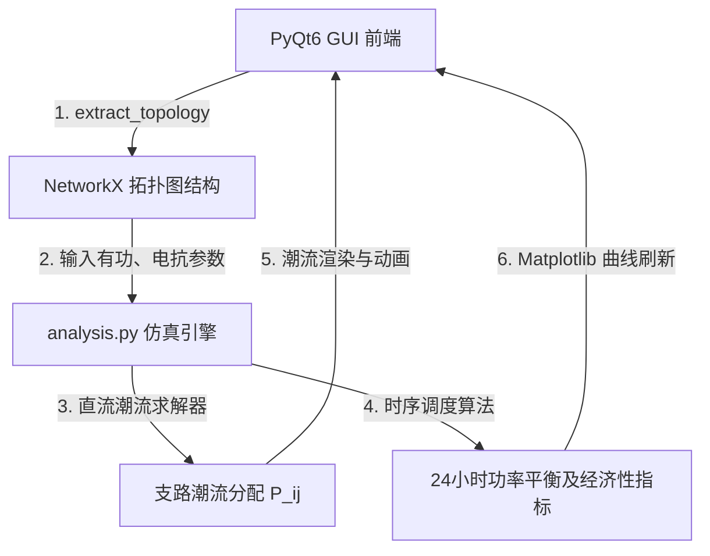

# 新能源微电网运行与经济性分析平台：核心原理与使用指南

本说明文档深入解析了**新能源微电网运行与经济性分析平台**的底层数学模型、拓扑解析架构、调度控制算法以及如何运行独立的控制台示例。

---

## 目录

1. [系统总体架构](#1-系统总体架构)
2. [核心数学与控制原理](#2-核心数学与控制原理)
    - [直流潮流模型 (DC Power Flow)](#直流潮流模型-dc-power-flow)
    - [储能系统日间经济调度策略](#储能系统日间经济调度策略)
    - [全寿命周期综合度电成本 (LCOE)](#全寿命周期综合度电成本-lcoe)
3. [程序拓扑解析与通信机制](#3-程序拓扑解析与通信机制)
4. [独立控制台示例运行指南](#4-独立控制台示例运行指南)
5. [运行结果与曲线深度解读](#5-运行结果与曲线深度解读)

---

## 1. 系统总体架构

该平台采用经典的**图形-算法双层解耦架构**设计，确保了前端交互的流畅度与底层电力系统分析算法的可扩展性。



- **前端交互层 (GUI Canvas)**：基于 `PyQt6` 的 `QGraphicsView` 和 `QGraphicsScene` 框架。实现无缝缩放、网格对齐、元件拖拽挂载和 Manhattan 风格的自适应直角连线。
- **拓扑转换层 (Data Model)**：通过遍历画布场景图元，动态提取为一个带有节点和支路属性的 `networkx.Graph` 拓扑。
- **算法仿真层 (Backend Engine)**：集成 `Numpy` 与自定义数值求解器，运行潮流状态评估、24小时储能经济性调度、LCOE 度电成本估算。

---

## 2. 核心数学与控制原理

### 直流潮流模型 (DC Power Flow)

在交流电力系统中，精确的潮流计算（如 Newton-Raphson 法）需要求解非线性非凸方程。为了在微电网拓扑规划中实现毫秒级的交互计算，本项目引入了工业界广泛采用的**直流潮流法 (DC Power Flow)**。

#### 1. 物理简化假设
- **电压幅值恒定**：假设所有节点电压幅值均为基准值（$U_i \approx 1.0 \text{ p.u.}$）。
- **相位差微小**：相邻节点电压相位差很小，满足 $\sin(\theta_i - \theta_j) \approx \theta_i - \theta_j$。
- **忽略线路电阻**：仅考虑输电支路的电抗 $X_{ij}$（即导纳 $G_{ij} \approx 0$），忽略有功损耗。

#### 2. 数学方程推导
对于连接节点 $i$ 和 $j$ 的输电支路，其传输的有功功率 $P_{ij}$ 可以表示为：
$$P_{ij} = \frac{\theta_i - \theta_j}{X_{ij}}$$

对微电网中的每一个节点 $i$，其注入有功功率 $P_i$（发电机出力减去负荷需求）必须等于流出该节点的所有支路功率之和：
$$P_i = \sum_{j \in \Omega_i} \frac{\theta_i - \theta_j}{X_{ij}}$$

写成矩阵形式即为：
$$\mathbf{P} = \mathbf{B} \cdot \boldsymbol{\theta}$$

其中：
- $\mathbf{P} \in \mathbb{R}^{n \times 1}$ 是节点注入有功功率向量。
- $\boldsymbol{\theta} \in \mathbb{R}^{n \times 1}$ 是各节点电压相位角向量。
- $\mathbf{B} \in \mathbb{R}^{n \times n}$ 是**节点电纳矩阵 (Bus Susceptance Matrix)**，其矩阵元素的构建规则为：
  - 对角线元素（自电纳）：$B_{ii} = \sum_{j \in \Omega_i} \frac{1}{X_{ij}}$
  - 非对角线元素（互电纳）：$B_{ij} = -\frac{1}{X_{ij}}$

#### 3. 平衡节点 (Slack Bus) 与奇异性解决
由于电纳矩阵 $\mathbf{B}$ 每一行元素的代数和为 0，$\mathbf{B}$ 是奇异矩阵（不可逆）。物理上，这是因为电压相位只有相对值才有意义，且系统总功率必须随时保持平衡。
- **解决方法**：指定一个“平衡节点”（通常为外接大电网 Grid），并将其相位角设为基准参考值（$\theta_{\text{slack}} = 0$）。
- 删去对应平衡节点的行和列，得到简化的非奇异矩阵 $\mathbf{B}_{\text{reduced}}$。通过解线性方程组求出其余节点的相位角：
  $$\boldsymbol{\theta}_{\text{reduced}} = \mathbf{B}_{\text{reduced}}^{-1} \cdot \mathbf{P}_{\text{reduced}}$$
- 最后，根据支路阻抗公式反求各连线的潮流大小与实际流向：$P_{ij} = (\theta_i - \theta_j)/X_{ij}$。

> [!TIP]
> **多孤岛拓扑自适应**：若用户拉出了两套互不连接的微电网（即拓扑图包含多个连通分量/Connected Components），底层算法将利用 NetworkX 的 `connected_components` 分离出子系统，对每个子系统分别指定平衡节点并求解，避免了计算发散。

---

### 储能系统日间经济调度策略

微电网的核心在于多能互补与“削峰填谷”。系统预设了 24 小时的分时电价（TOU Price）曲线 $\mathbf{Pr} \in \mathbb{R}^{24}$、日照出力曲线、风速出力曲线以及负荷用电曲线。

项目采用了一种**启发式门限经济调度控制策略**对储能系统（Battery）进行充放电管理：

```mermaid
flowchart TD
    Start([每个时段 i = 0...23]) --> ReadData[读取该时段净负荷 P_net = P_load - P_renew - P_gen]
    ReadData --> CheckNeed{净负荷 P_net > 0 ?}
    
    CheckNeed -- 是 (缺电) --> IsHighPrice{当前电价高于 60% 分位数 ?}
    IsHighPrice -- 是 (电贵) --> Discharge[储能放电: P_bat = min(P_net, P_max * 0.45)]
    IsHighPrice -- 否 (电平) --> NoStorage1[储能不动作, 从电网购电]
    
    CheckNeed -- 否 (余电) --> IsLowPrice{当前电价低于 45% 分位数 ?}
    IsLowPrice -- 是 (电便宜) --> Charge[储能充电: P_bat = -min(|P_net|, P_max * 0.35)]
    IsLowPrice -- 否 (电平) --> NoStorage2[储能不动作, 余电上网]
    
    Discharge --> CalcCost[计算当前时段购电费用与运行成本]
    Charge --> CalcCost
    NoStorage1 --> CalcCost
    NoStorage2 --> CalcCost
    CalcCost --> End([下一个时段])
```

1. **富余发电时段（净负荷 $P_{\text{net}} < 0$）**：
   - 当大电网电价处于低谷（低于 $45\%$ 分位数）时，储能系统以最大充电限制功率 $\min(|P_{\text{net}}|, P_{\text{max}} \times 0.35)$ 吸收多余绿色电量，以备高峰使用。
2. **缺电负荷高峰时段（净负荷 $P_{\text{net}} > 0$）**：
   - 当大电网电价处于高峰（高于 $60\%$ 分位数）时，储能系统进行有偿放电 $\min(P_{\text{net}}, P_{\text{max}} \times 0.45)$，从而避免在高电价时段直接向大电网购电，实现套利。
3. **时段运行成本计算**：
   $$\text{Cost}_t = \text{Fuel\_Cost}_t (\text{可控电源燃油费}) + \text{Storage\_Degradation}_t (\text{储能寿命折损}) + \text{Grid\_Exchange\_Fee}_t (\text{电网购售电网费})$$
   - 储能每充放一度电，计入 $0.06$ 元/kWh 的寿命衰减折旧成本。
   - 上网卖电价格通常按买电价的 $55\%$ 结算（回馈低谷电价）。

---

### 全寿命周期综合度电成本 (LCOE)

平准化度电成本（LCOE, Levelized Cost of Energy）是评估微电网项目投资可行性的关键核心指标。它表示微电网系统在其生命周期内，每发（或每供）一度电所需要分摊的建设与运营总成本。

本项目数学模型表述为：
$$LCOE = \frac{C_{\text{annualized\_cap}} + C_{\text{annual\_operating}}}{E_{\text{annual\_load}}}$$

#### 1. 年化建设投资成本 ($C_{\text{annualized\_cap}}$)
各元件根据其额定容量大小，乘以单位造价，求出总建设投资（CAPEX）。由于投资发生在期初，需要引入折现率将 CAPEX 分摊到每年。算法使用**资本回收系数（CRF, Capital Recovery Factor）**进行年化：
$$C_{\text{annualized\_cap}} = \text{CAPEX} \cdot \gamma$$
其中，年化折现率系数项目默认设定为 $\gamma = 8.5\%$。

各元件的单位建设成本配置如下表（来源于真实行业参考价）：

| 元件类型 | 英文 Symbol | 单位造价 (元/kW) | 说明 |
| :--- | :--- | :---: | :--- |
| **光伏发电** | PV | 3,800 | 包含组件、支架、并网逆变 |
| **风力发电** | WT | 6,200 | 包含风电机组、塔筒、基础 |
| **微燃机** | MT | 4,500 | 分布式天然气热电联产核心机组 |
| **燃料电池** | FC | 9,000 | 氢能发电系统 |
| **电池储能** | Battery | 1,200 | 磷酸铁锂电池电芯及BMS/PCS系统 |
| **电解槽** | EL | 4,200 | 碱性/质子交换膜电解制氢设备 |
| **母线/逆变器** | AC/DC Bus / Converter | 300 ~ 600 | 配电线缆与变换拓扑基础投资 |

#### 2. 年运行维护及购电成本 ($C_{\text{annual\_operating}}$)
根据日间 24 小时运行仿真，得出单日系统总运营成本（包括购电费、微燃机燃料费及储能动作损耗费之和），乘以全年天数得到：
$$C_{\text{annual\_operating}} = \text{Operating\_Cost}_{\text{day}} \times 365$$

#### 3. 全年总负荷耗电量 ($E_{\text{annual\_load}}$)
$$E_{\text{annual\_load}} = E_{\text{load\_day}} \times 365$$

---

## 3. 程序拓扑解析与通信机制

GUI 前端与底层数学求解器并非杂乱地杂糅在一起，而是通过专门的**拓扑提取函数**进行高内聚低耦合的数据中转。

1. **提取阶段**：
   - 遍历 `QGraphicsScene` 中所有活动的 `MicrogridNode` 图元，读取其唯一名称（`name`）、元件代号（`symbol`）、以及封装在 `node.data` 中的动态参数属性（如功率、电压、阻抗等）。
   - 遍历所有 `ConnectionLine` 图元，当检测到连线左右引脚（`NodePort`）都有绑定节点时，在 `networkx.Graph` 中创建一条边，并将阻抗等参数写入边的属性字典中。
2. **计算阶段**：
   - 运行 `analyze_microgrid()`，仅依赖 `networkx` 纯数据结构和 `numpy` 进行计算，**完全脱离 GUI 线程**，可独立于界面做高并发蒙特卡洛仿真。
3. **数据反向绑定渲染**：
   - 计算结束后，返回 `AnalysisResult` 数据类，其中包含 `flows`（各输电支路计算出的有功功率流向和数值）。
   - 前端接收到结果后，遍历所有 `ConnectionLine` 图元，调用 `update_power_flow(flow_value)`：
     - 若 $P_{ij} > 0$，代表电流正向流动，中间潮流箭头朝右或下；若 $P_{ij} < 0$，箭头反转。
     - 连线线宽和颜色根据功率绝对值自适应渲染（如重载 $>300\text{ kW}$ 呈醒目的暗红色，轻载 $<100\text{ kW}$ 呈平稳的绿色）。

---

## 4. 独立控制台示例运行指南

为了方便调试底层电力算法、或者在无 GUI 环境（如服务器、Jupyter Notebook）下测试调度效果，项目编写了一个全自动的独立控制台运行示例：`run_example.py`。

### 运行步骤
1. 打开命令行（PowerShell 或 CMD）。
2. 执行以下命令运行独立脚本：
   ```powershell
   D:/Anaconda3/envs/science/python.exe e:/Python_projects/pytools/gridmanagement/run_example.py
   ```
3. 系统将自动在后台组装拓扑、提取网络参数，随后在控制台输出详尽的**中文仿真计算报告**与**24小时功率平衡及电网购电明细表**。
4. 同时，该脚本还会在当前目录下生成一张精美的可视化双子图：`example_result_chart.png`。

---

## 5. 运行结果与曲线深度解读

运行独立示例或在客户端点击“加载示例系统”并“运行分析”后，我们可以得到如下深入的指标与特性：

### 1. 指标分析与策略解释
- **可再生能源发电占比（绿色占比）为 109.3%**：
  - 代表微电网全天太阳能和风能的总发电量超出了全天总用电负荷之和。系统不仅实现了自给自足，还有多余的清洁能源可供上网。
- **日净购电量为 -395.4 kWh**：
  - 净购电量为负数表示全天向大电网售电量（余电上网）大于从大电网的购电量，微电网对外部大电网起到了积极的能量支撑作用。
- **日运行成本为 -102.39 元**：
  - 负的运行成本表示今天靠向大电网卖电（高电价时段）以及内部储能优化调度，不但冲抵了可控发电机买燃料的钱，还**净赚了 102.39 元**！

### 2. 时序调度曲线图解
生成的 `example_result_chart.png` 图表非常直观地展现了削峰填谷的过程：

- **0:00 - 6:00 (谷电价时段)**：
  - 此时无光伏发电，风力出力较为充沛。大电网电价低谷，负荷较低。
  - 柱状图中**储能系统呈现负值（绿色阴影向下）**，系统控制储能开始大量“吸纳充电”，为白天的用电高峰储备低造价电量。
- **11:00 - 15:00 (午间发电高峰与平价时段)**：
  - 光伏达到一天中的出力最高峰，风电维持稳定。总发电量远大于负荷。
  - 多余的绿色电力直接通过母线注入电网，或者转换为电解槽（EL）用电负荷（用于制氢储能），时段运行成本跌入负值（通过向电网大量输电套利）。
- **18:00 - 20:00 (晚间用电最高峰与峰电价时段)**：
  - 此时夕阳西下，光伏出力降为0，而居民负荷迎来一天中的最大双峰之一。此时电网买电电价最贵。
  - **储能系统迅速动作，呈现正值（绿色阴影向上）**，将夜间低谷期蓄存的绿色电量进行集中释放，成功抵消了负荷的缺口，避免了微电网系统在最贵的电价点从大电网购电，实现了完美的“峰谷套利”与自我供电平衡。
